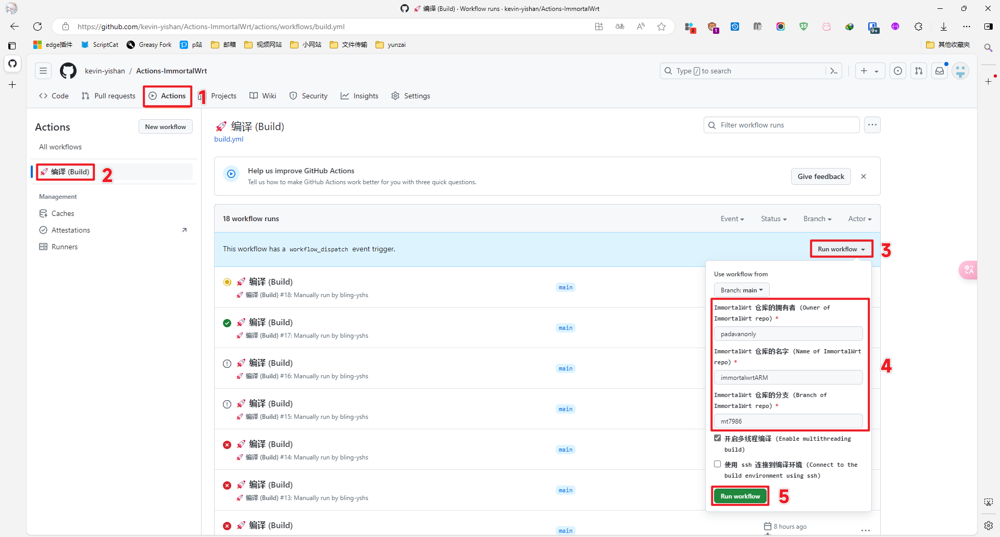
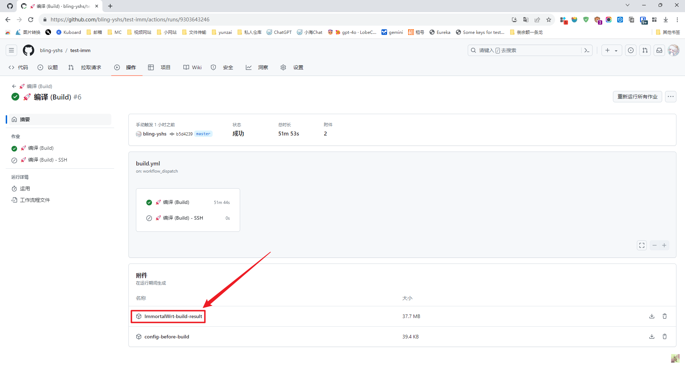
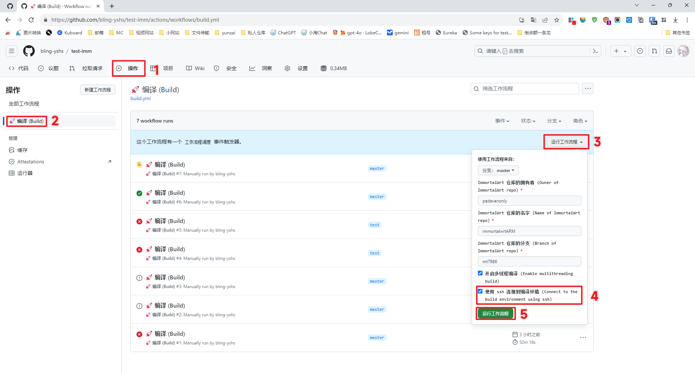
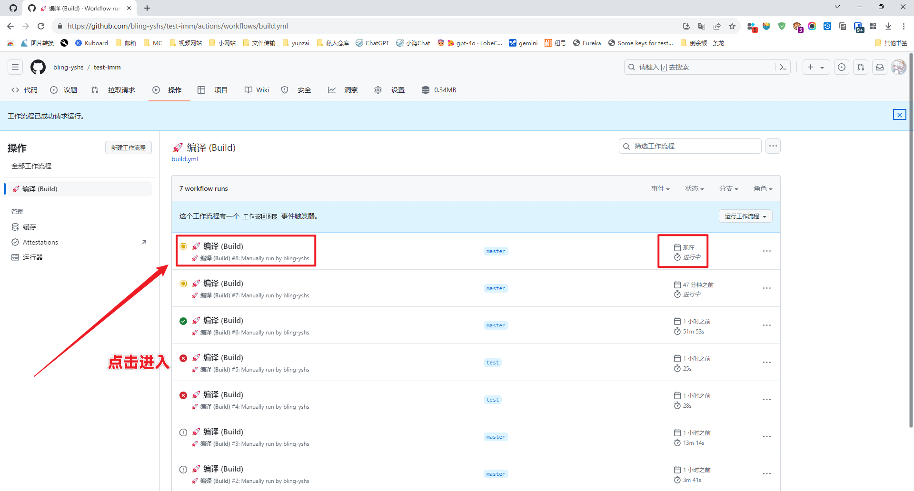
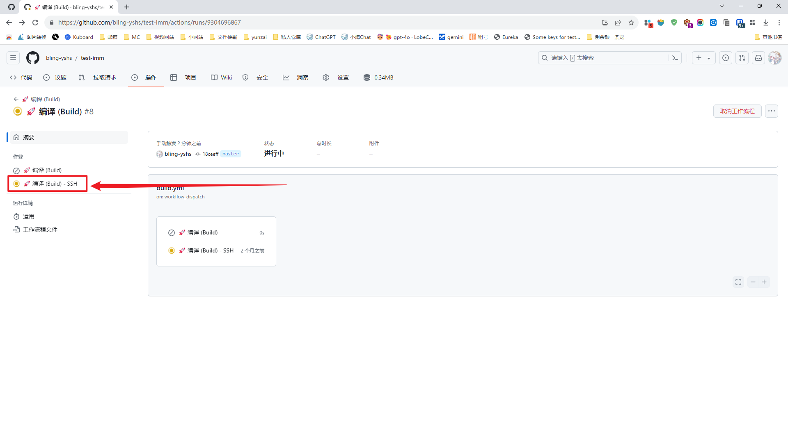
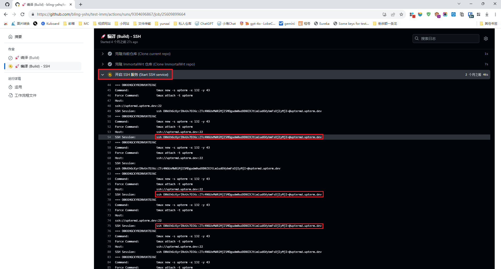
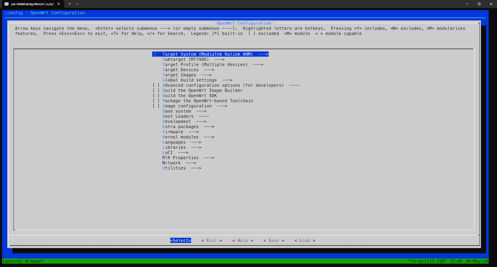
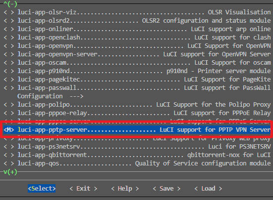

# ImmortalWrt 自动编译

## 使用步骤

### 正常流程

1. (必须) fork 本仓库
2. (必须) 上传 `.config` 文件与 `feeds.conf.default` 文件到此仓库
3. (可选) 编辑仓库内的 `diy.sh` 文件，可以自定义编译前的命令，一般使用 git clone 来克隆需要使用到的第三方插件
4. - 进入本仓库的 Actions 页面
   - 在左侧选择 `🚀 编译 (Build)`
   - 右侧点击 Run workflow
   - 填入需要编译的仓库的信息
   - 最后点击绿色的 Run workflow
5. 等待编译完成，大约需要 2-3 小时
6. 当页面像这样显示绿色的✅的时候，就说明编译完成了，点击进去到这个界面找到 ImmortalWrt-build-result ，就是编译后的固件了。直接点击下载就可以

### 通过 SSH 连接到 Github Actions 进行编译

和正常流程几乎没有区别，只是可以省下自己开 codespaces 编译的时间，比较方便一点 (注意：此过程中自己上传的 `.config` 和 `feeds.conf.default` 不会自动复制到对应目录，`diy.sh` 也不会自动执行。但是你可以在连接到编译环境以后自己手动复制和修改)

1. (必须) fork 本仓库

2. (必须) 上传 `.config` 文件与 `feeds.conf.default` 文件到此仓库

3. (可选) 编辑仓库内的 `diy.sh` 文件，可以自定义编译前的命令，一般使用 git clone 来克隆需要使用到的第三方插件

4. - 进入本仓库的 Actions 页面
   - 在左侧选择 `🚀 编译 (Build)`
   - 右侧点击 Run workflow
   - 填入需要编译的仓库的信息
   - 把 **使用 ssh 连接到编译环境** 勾选上
   - 最后点击绿色的 Run workflow

5. 原地等待 10 秒，进入正在运行的 workflow

6. 点击左侧 `🚀 编译 (Build) - SSH` 

7. 找到 `开启 SSH 服务` 并展开，然后复制里面的 ssh session ，用自己的终端执行就可以连上了 (这里的 ssh session 都是一样的，随便找一个复制就行)

8. 连接成功以后，执行以下命令

   ```shell
   cd ImmortalWrt && ./scripts/feeds update -a && ./scripts/feeds install -a && make menuconfig
   ```

9. 根据自己的需要来定制 config

10. 保存以后会回到终端，**输入 `exit`  来退出 ssh**，退出以后会自动开始编译

11. 等待编译完成，大约需要 2-3 小时

12. 当页面像这样显示绿色的✅的时候，就说明编译完成了，点击进去到这个界面找到 ImmortalWrt-build-result ，就是编译后的固件了。直接点击下载就可以

## 如何定制 config 和 feeds：

1. 克隆对应分支的 openwrt 仓库(可以使用自己的 ubuntu 系统，教程里是利用免费的 github codespaces 进行定制)

2. 下载第三方插件，如
   ```shell
   git clone --depth=1 https://github.com/EOYOHOO/UA2F.git package/UA2F
   git clone --depth=1 https://github.com/EOYOHOO/rkp-ipid.git package/rkp-ipid
   ```

3. 更新 feeds
   ```shell
   ./scripts/feeds update -a && ./scripts/feeds install -a
   ```

4. 定制config，先输入
   ```shell
   make menuconfig
   ```
   会弹出插件配置界面，选择对应的 `Target System` ， `Subtarget` ， `Target Profile` ， 注意， `Target Profile` 必须精确到对应的设备名，否则理论上不兼容

5. 继续选择需要安装的插件，上下箭头移动，左右箭头切换底部选项卡，回车为选择进入，对着插件按空格会将插件前的标识变为 `M` ，再按一下空格会变成 `*` ，变成 `*` 才代表此插件被选中安装

6. 选择好需要的插件以后，用左右箭头切换到 `save` 选项卡按回车保存

7. 输入命令
   ```shell
   zip conf.zip feeds.conf.default .config
   ```
   会将 `feeds.conf.default` 与 `.config` 两个文件压缩为 `conf.zip` ，将 `conf.zip` 下载到本地，然后解压可以得到自己定制好的 config 和 feed 啦

## 编译之如何单独编译某一个模块

1. 想单独编译某一个模块，前提是你当前的环境已经编译过一次**完整的 openwrt 固件**才行，因为编译完整的 openwrt 固件时，它会自动编译工具链，没有工具链就没法单独编译模块，这一点你必须清楚地了解。如果你的当前环境已经编译过**完整的 openwrt 固件**了，但是还是显示缺少依赖，那么很抱歉，只能从头编译了

2. 确保你已经编译过一次完整的 openwrt 之后，先克隆对应仓库的地址到 package 文件夹下，格式如下：
   ```shell
   git clone --depth=1 仓库地址 package/项目名称
   ```

   例子：
   ```shell
   git clone --depth=1 https://github.com/iv7777/luci-app-pptp-server package/luci-app-pptp-server
   ```

3. 先清空下之前编译的残留物 `make clean`

4. 更新feeds
   ```shell
   ./scripts/feeds update -a && ./scripts/feeds install -a
   ```

5. 执行 `make menuconfig` ，选择对应的 Target System，Subtarget，Target Profile

6. 找到对应的模块的位置，将其选定，标记为M，M代表以模块方式编译，这样我们就不需要编译整个 openwrt 也可以编译出 ipk 文件啦。如图所示，选中以后记得选择 Save 来保存哦

7. 开始编译吧，格式如下：
    ```shell
    make package/项目名称/compile V=s
    ```

   例子：
   ```shell
   make package/luci-app-pptp-server/compile V=s
   ```

## 我常用的一些插件

1. luci-theme-argon-new(openwrt网页主题)

2. luci-app-openclash(科学上网)

3. luci-app-sqm(智能网速控制)

4. luci-app-ttyd(网页终端)

5. luci-app-upnp(自动upnp)

[//]: # (Kernel Modules->Other modules->kmod-rkp-ipid)

[//]: # (Kernel Modules->Netfilter Extensions->kmod-ipt-u32)

[//]: # (Network->Routing and Redirection->ua2f)

[//]: # (Network->SSH->openssh-sftp-server)

[//]: # (Network->Firewall->iptables-mod-filter)

[//]: # (Network->Firewall->iptables-mod-u32)

[//]: # (Luci->Theme->luci-theme-argon-new)

[//]: # (Luci->Applications->luci-app-openclash)

[//]: # (Luci->Applications->luci-app-ttyd)

[//]: # (Luci->Applications->luci-app-upnp)

[//]: # (记得最后搜索 Netfilter Extensions 加上 CONFIG_NETFILTER_NETLINK_GLUE_CT=y)
