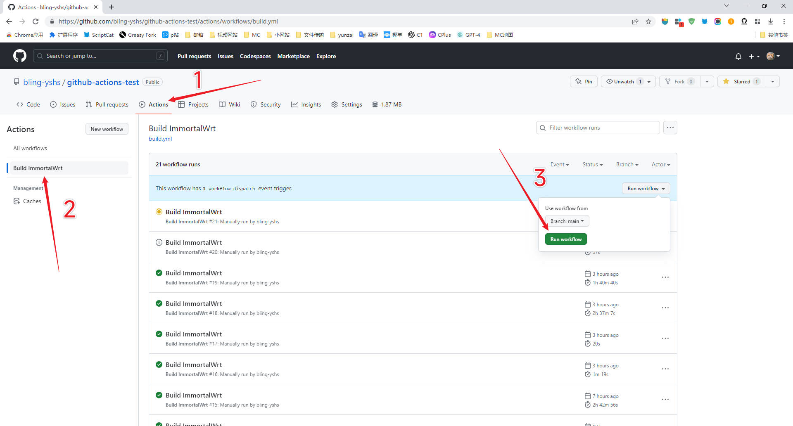

# ImmortalWrtARM 自动编译

## 使用步骤：

0. fork 本仓库
1. 上传 `.config` 文件与 `feeds.conf.default` 文件到此仓库，替换掉仓库里本来的文件
2. 编辑仓库内的 `diy.sh` 文件，可以自定义编译前的命令，一般使用 git clone 来克隆需要使用到的第三方插件
3. 编辑仓库内的 `.github\workflows\build.yml` 文件，修改里面的变量，具体如下：
    - ```yml
      env:
          CLONE_COMMAND: git clone -b mt7986 --depth 1 https://github.com/padavanonly/immortalwrtARM
          REPO_NAME: immortalwrtARM
      ```
        将 `CLONE_COMMAND: ` 后面的内容改为克隆具体的仓库，` https://github.com/padavanonly/immortalwrtARM` 代表仓库链接，`-b mt7986` 代表仅克隆仓库内的 mt7986 分支。  
         再将 `REPO_NAME: ` 后面的内容改为仓库名称，也就是仓库链接 `https://github.com/padavanonly/immortalwrtARM` 最后一个斜杠末尾的字符串，即 `immortalwrtARM`
    - 举个例子，我想编译 `https://github.com/openwrt/openwrt` 的 `openwrt-23.05` 分支，那么我需要将其修改为：
        ```yml
        env:
            CLONE_COMMAND: git clone -b openwrt-23.05 --depth 1 https://github.com/openwrt/openwrt
            REPO_NAME: openwrt
        ```
4. 进入本仓库的 Actions 页面，在左侧选择 Build ImmortalWrt，右侧点击 Run workflow，最后点击绿色的 Run workflow
   <br>
   
   <br>
5. 等待编译完成，大约需要 2-3 小时
6. 进入编译完成的 workflow，点击左侧 Summary，下载 ImmortalWrt_build_files，解压后即为编译完成后的固件
   <br>
   
   <br>
