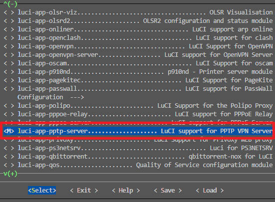

# ImmortalWrtARM 自动编译

## 使用步骤：

0. fork 本仓库

1. 上传 `.config` 文件与 `feeds.conf.default` 文件到此仓库(必须)

2. 编辑仓库内的 `diy.sh` 文件，可以自定义编译前的命令，一般使用 git clone 来克隆需要使用到的第三方插件

3. 编辑仓库内的 `.github\workflows\build.yml` 文件，修改里面的变量，具体如下：

    - ```yml
      env:
          CLONE_COMMAND: git clone -b mt7986 --depth 1 https://github.com/padavanonly/immortalwrtARM
          REPO_NAME: immortalwrtARM
      ```

        将 `CLONE_COMMAND:` 后面的内容改为克隆具体的仓库，`https://github.com/padavanonly/immortalwrtARM` 代表仓库链接，`-b mt7986` 代表仅克隆仓库内的 mt7986 分支。  

        再将 `REPO_NAME:` 后面的内容改为仓库名称，也就是仓库链接 `https://github.com/padavanonly/immortalwrtARM` 这一串地址的最后一个斜杠末尾的字符串，即 `immortalwrtARM`
        
    - 举个例子，我想编译 `https://github.com/openwrt/openwrt` 的 `openwrt-23.05` 分支，那么我需要将其修改为：

        ```yml
        env:
            CLONE_COMMAND: git clone -b openwrt-23.05 --depth 1 https://github.com/openwrt/openwrt
            REPO_NAME: openwrt
        ```

    - **一定要注意yml语法，`CLONE_COMMAND:` 和 `REPO_NAME:` 后面都需要有一个空格，否则会报错**

4. 进入本仓库的 Actions 页面，在左侧选择 Build ImmortalWrt，右侧点击 Run workflow，最后点击绿色的 Run workflow
   <br>
   
   <br>

5. 等待编译完成，大约需要 2-3 小时

6. 进入编译完成的 workflow，点击左侧 Summary，下载 ImmortalWrt_build_files，解压后即为编译完成后的固件
   <br>
   
   <br>

## (补充)前置步骤，定制 config 和 feeds：
1. 克隆对应分支的 openwrt 仓库(可以使用自己的 ubuntu 系统，教程里是利用免费的 github codespace 进行定制)

2. 下载第三方插件，如
    ```bash
    git clone https://github.com/EOYOHOO/UA2F.git package/UA2F
    git clone https://github.com/EOYOHOO/rkp-ipid.git package/rkp-ipid
    git clone https://github.com/kongfl888/luci-app-timedreboot package/timedreboot
    ```

3. 更新feeds
    ```bash
    ./scripts/feeds update -a && ./scripts/feeds install -a
    ```

4. 定制config，先输入
    ```bash
    make menuconfig
    ```
    会弹出插件配置界面，选择对应的 `Target System` ， `Subtarget` ， `Target Profile` ， 注意， `Target Profile` 必须精确到对应的设备名，否则理论上不兼容

5. 继续选择需要安装的插件，上下箭头移动，左右箭头切换底部选项卡，回车为选择进入，对着插件按空格会将插件前的标识变为 `M` ，再按一下空格会变成 `*` ，变成 `*` 才代表此插件被选中安装

6. 选择好需要的插件以后，用左右箭头切换到 `save` 选项卡按回车保存

7. 输入命令
    ```bash
    zip conf.zip feeds.conf.default .config
    ```
    会将 `feeds.conf.default` 与 `.config` 两个文件压缩为 `conf.zip` ，将 `conf.zip` 下载到本地，然后解压可以得到自己定制好的config和feed啦

## (补充)与本项目无关的一些有关 openwrt 编译的干货

### 编译之如何单独编译某一个模块

1. 想单独编译某一个模块，前提是你当前的环境已经编译过一次**完整的 openwrt 固件**才行，因为编译完整的 openwrt 固件时，它会自动编译工具链，没有工具链就没法单独编译模块，这一点你必须清楚地了解。如果你的当前环境已经编译过**完整的 openwrt 固件**了，但是还是显示缺少依赖，那么很抱歉，只能从头编译了

2. 确保你已经编译过一次完整的 openwrt 之后，先克隆对应仓库的地址到 package 文件夹下，格式如下：
    ```bash
    git clone 仓库地址 package/项目名称
    ```

    例子：
    ```bash
    git clone https://github.com/iv7777/luci-app-pptp-server package/luci-app-pptp-server
    ```


3. 先清空下之前编译的残留物 `make clean`

4. 更新feeds
    ```bash
    ./scripts/feeds update -a && ./scripts/feeds install -a
    ```

5. 执行 `make menuconfig` ，选择对应的 Target System，Subtarget，Target Profile

6. 找到对应的模块的位置，将其选定，标记为M，M代表以模块方式编译，这样我们就不需要编译整个 openwrt 也可以编译出 ipk 文件啦。如图所示，选中以后记得选择 Save 来保存哦
    <br>
    
    <br>

7. 开始编译吧，格式如下：
    ```bash
    make package/项目名称/compile V=99
    ```

    例子：
    ```bash
    make package/luci-app-pptp-server/compile V=99
    ```

### (补充)我常用的一些插件

1. luci-theme-argon-new(openwrt网页主题)

2. luci-app-sqm(智能网速控制)

3. luci-app-timedreboot(定时重启)

4. luci-app-upnp(自动upnp)

5. luci-app-ttyd(网页终端)

6. luci-app-openclash(科学上网)

7. luci-app-eqos(网速限制)

<!-- 
kernel-modules->Other modules->kmod-rkp-ipid
kernel modules->Netfilter Extensions->kmod-ipt-u32
network->Routing and Redirection->ua2f
network->firewall->iptables-mod-filter
network->firewall->iptables-mod-u32

记得最后搜索 Netfilter Extensions 加上 CONFIG_NETFILTER_NETLINK_GLUE_CT=y
 -->